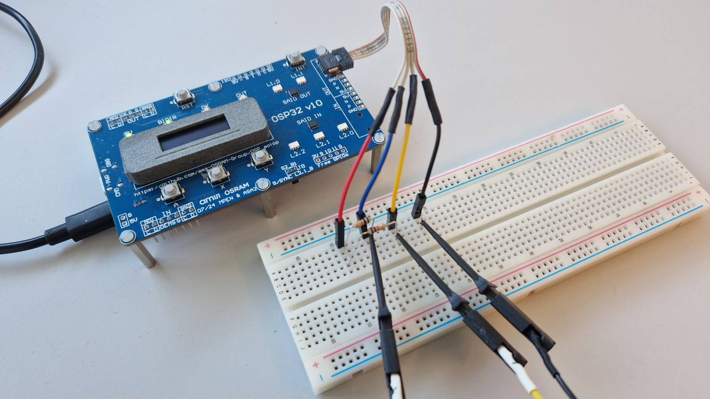
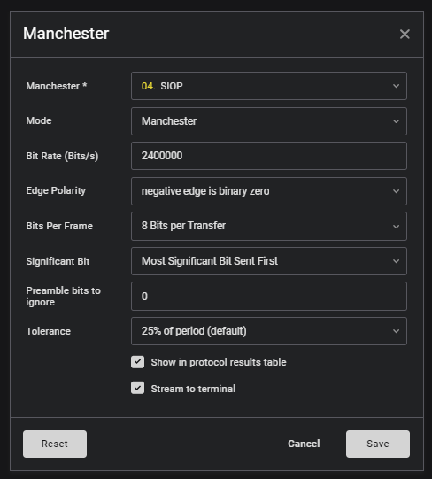
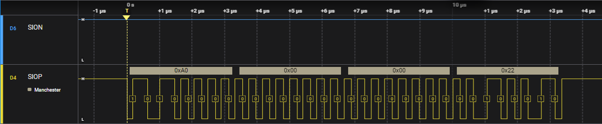
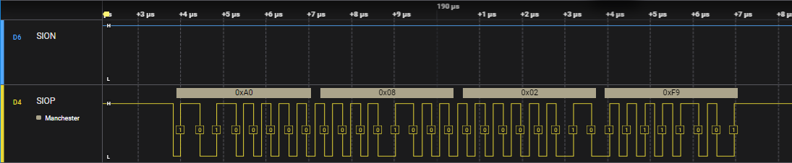

# Bring-up

This project helps checking if an MCU communicates with an OSP node.


## Introduction

When bringing up an OSP based system, the first hurdle is to get communication
established, most notably between the MCU and the first node. The obvious
way to detect successful communication is to switch on an LED of the node.

However, this requires not only successful communication, but also a correct
sequence of telegrams (assign address, clear errors, switch to active state,
set drive current, set PWM value).

In this sketch we just send a RESET telegram to one node, and check whether
that node forwards it. 

An optional next step is sending INITBIDIR. Remember that a node needs 
150 μs for executing a RESET; a delay for that needs to precede the 
INITBIDIR telegram.


## Hardware

The demo runs on the OSP32 board. We cut a MiniBridge cable in two, plug it
in OUT, add a pull-up on SION and SIOP, and connect a logic analyzer.
An alternative is to use the OUT pin header to solder a header or even
directly pull-ups. Recommended pull-up value is 10kΩ.



The two pull-ups configure the port for USE mode (aka CAN mode).
Unlike the standard LVDS mode, this uses voltage levels to communicate,
so easier to capture using a logic analyzer.


## Logic analyzer

We used a [Saleae](https://www.saleae.com/) logic analyzer.
It even has a slicer for Manchester. These are the settings for the slicer.




## Software

Run the `aospi_bringup.ino` sketch (compile for "ESP32S3 Dev Module" and upload).
It will send a RESET and INITBIDIR every second. Arm the Saleae for a capture
to create a trace. The resulting [trace](extras/trace.sal) has two telegrams,
one for RESET, one for INITBIDIR.


## RESET trace

The first trace captures the RESET telegram.



The MCU sends `A0 00 00 22` to SIO1 of the node, and we see that the
node indeed forwards the same bytes to the (non-existent) next node.
We can use `OSP_aospi\python\telegram` to draw the telegram.

```
(env) OSP_aospi\python\telegram>run A0 00 00 22
          +---------------+---------------+---------------+---------------+
byteval   |      A0       |      00       |      00       |      22       |
byteix    |0 0 0 0 0 0 0 0|1 1 1 1 1 1 1 1|2 2 2 2 2 2 2 2|3 3 3 3 3 3 3 3|
bitix     |7 6 5 4 3 2 1 0|7 6 5 4 3 2 1 0|7 6 5 4 3 2 1 0|7 6 5 4 3 2 1 0|
bitval    |1 0 1 0 0 0 0 0|0 0 0 0 0 0 0 0|0 0 0 0 0 0 0 0|0 0 1 0 0 0 1 0|
          +-------+-------+-----------+---+-+-------------+---------------+
field     |preambl|      address      | psi |   command   |      crc      |
bin       | 1010  |    0000000000     | 000 |   0000000   |   00100010    |
hex       |  0xA  |       0x000       | 0x0 |    0x00     |   0x22 (ok)   |
meaning   |   -   |     broadcast     |  0  |    reset    |    34 (ok)    |
          +-------+-------------------+-----+-------------+---------------+
```

This proves that the node is operational: it receives a telegram from the MCU
and processes it (forwards it).


## INITBIDE trace

Even more convincing is the trace of the INITBIDIR.
The MCU sends `A0 04 02 A9` to SIO1, this means INITBIDIR(001),
i.e. init and assign yourself address 001

```
(env) OSP_aospi\python\telegram>run A0 04 02 A9
          +---------------+---------------+---------------+---------------+
byteval   |      A0       |      04       |      02       |      A9       |
byteix    |0 0 0 0 0 0 0 0|1 1 1 1 1 1 1 1|2 2 2 2 2 2 2 2|3 3 3 3 3 3 3 3|
bitix     |7 6 5 4 3 2 1 0|7 6 5 4 3 2 1 0|7 6 5 4 3 2 1 0|7 6 5 4 3 2 1 0|
bitval    |1 0 1 0 0 0 0 0|0 0 0 0 0 1 0 0|0 0 0 0 0 0 1 0|1 0 1 0 1 0 0 1|
          +-------+-------+-----------+---+-+-------------+---------------+
field     |preambl|      address      | psi |   command   |      crc      |
bin       | 1010  |    0000000001     | 000 |   0000010   |   10101001    |
hex       |  0xA  |       0x001       | 0x0 |    0x02     |   0xA9 (ok)   |
meaning   |   -   |    unicast(1)     |  0  |  initbidir  |   169 (ok)    |
          +-------+-------------------+-----+-------------+---------------+
```

The outgoing telegram is different.



We see the bytes `A0 08 02 F9`; when we plot that we get the following diagram.

```
(env) OSP_aospi\python\telegram>run A0 08 02 F9
          +---------------+---------------+---------------+---------------+
byteval   |      A0       |      08       |      02       |      F9       |
byteix    |0 0 0 0 0 0 0 0|1 1 1 1 1 1 1 1|2 2 2 2 2 2 2 2|3 3 3 3 3 3 3 3|
bitix     |7 6 5 4 3 2 1 0|7 6 5 4 3 2 1 0|7 6 5 4 3 2 1 0|7 6 5 4 3 2 1 0|
bitval    |1 0 1 0 0 0 0 0|0 0 0 0 1 0 0 0|0 0 0 0 0 0 1 0|1 1 1 1 1 0 0 1|
          +-------+-------+-----------+---+-+-------------+---------------+
field     |preambl|      address      | psi |   command   |      crc      |
bin       | 1010  |    0000000010     | 000 |   0000010   |   11111001    |
hex       |  0xA  |       0x002       | 0x0 |    0x02     |   0xF9 (ok)   |
meaning   |   -   |    unicast(2)     |  0  |  initbidir  |   249 (ok)    |
          +-------+-------------------+-----+-------------+---------------+
```

Note that the outgoing telegram is INITBIDIR(002), so we see that the
node has actively transformed the incoming telegram: stepped the address,
and recomputed the checksum.

This means we have successful MCU-SAID communication.


## Afterthought

There are many things that can go wrong. See this libraries readme for a list
of [issues](https://github.com/ams-OSRAM/OSP_aospi?tab=readme-ov-file#issues).

(end)
