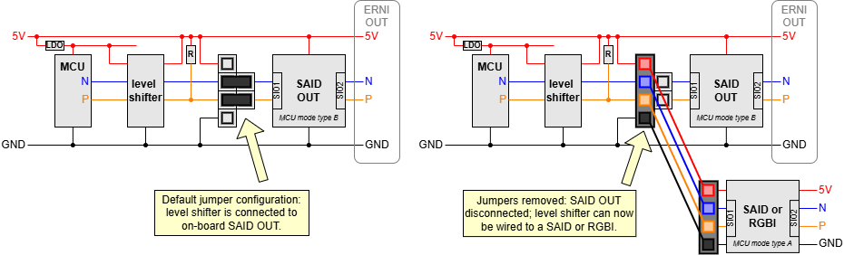
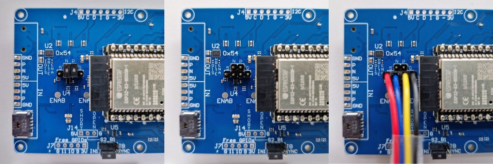
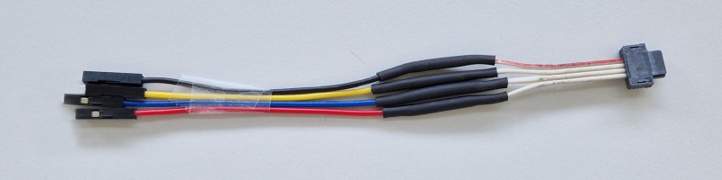
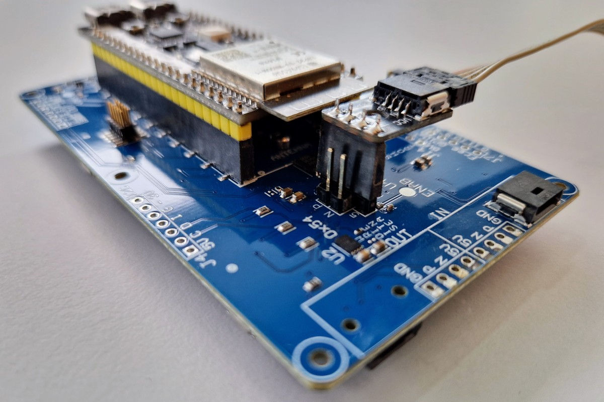

# MCU mode type A

The OSP32 board has an on-board SAID.
This SAID is connected to the MCU.
They communicate using physical layer _MCU mode type B_
also known as two-wire SPI.

This document explains how to reconfigure the OSP32 board to use 
_MCU mode type A_ also known as one-wire Manchester. 
This is the physical layer the RGBI chips use.
It is also the default mode of the SAIDs. The SAID OUT on the
OSP32 board has a bit burned in its OTP to use type B instead.

> You need an OSP32 board V11 or higher to be able to reconfigure as described here.

Example [OSP_aospi/examples/aospi_mcua](https://github.com/ams-OSRAM/OSP_aospi/tree/main/examples/aospi_mcua)
uses the reconfiguration described in this documentation.

## Schematics

On the OSP32 board, the MCU (and ESP32) has its internal SPI block 
wired, via a level shifter, to (SIO1 of) SAID OUT. SIO2 of SAID OUT
is exposed on the ERNI connector labeled OUT. This is the start of the 
OSP chain. 

The SAID OUT on the OSP32 board has a bit (`SPI_mode`) burned in its OTP 
to use type B communication, instead of the default type A communication. 
This cannot be changed (OTP burn is forever). In order to use type A 
communication, we need to bypass SAID OUT, and either connect an RGBI or 
a SAID without the `SPI_mode` bit burned to 1.

The OSP32 board, v11 and higher, has jumpers to wire the bypass. 
The schematics below show the jumpers. By default they route the N and P
line from the MCU (level shifter) to SAID. When the jumpers are removed
the N and P line are interrupted, and another OPS node can be connected.
To make this easier, the jumpers have a 5V and a GND next to it.

## Reconfigure

Physically, the jumpers is on the backside of the OSP32 board, below 
SAID OUT. The photo on the right shows the N and P jumper present, the 
default configuration. The middle photo shows the two jumpers removed.
We have now for pins exposed: 5, N, P, G; this is precisely what an 
ERNI cable carries. The photo on the right shows a patched ERNI cable 
being plugged into those four pins.

## New connection

We made the cable by cutting a standard ERNI cable and soldering 
four female jumper connectors. The other side, the ERNI connectors
can then be plugged in, for example, the RGBI strip, the SAIDbasic board 
or the SAIDlooker board.

As an alternative we made an ERNI breakout board: a smal PCB converting 
from 4 pin female header to ERNI

## Pull-up

The OSP32 has a pull-up on the P line (see schematics at the start of 
this document). It would have maybe been better if this pull-up were 
on the SAID side of the jumpers, but it is on the MCU side. This 
means that even with the jumpers removed, the P line is pulled up.

This has the advantage that if you plug in a SAID or an RGBI it is
configured for MCU mode automatically.

If you want to do an experiment with USE mode, you have to add a pull-up 
on N as well. If you would want EOL or LVDS mode, you would have to remove
the R.

## Match

There must be a match between the hardware and software.

- When using SAID OUT (no bypass), the software must configure `aospi`
  for type B (`aospi_phy_mcub`), because the SAID OUT is configured for
  that (a bit permanently burned in its OTP).
  
- When bypassing the SAID OUT and connecting another head node, we need to 
  know which physical layer that head node uses.
  
  - If the new head node is an RGBI (E3731I), software must use type A 
    (`aospi_phy_mcua`) because that is the only protocol implemented 
    by RGBI (in its controller).
    
  - If the new head node is a SAID (AS1163), there are two options. Either
    the SAID has the OTP bit `SPI_mode` clear (default), in which case
    software must use type A (`aospi_phy_mcua`). If the OTP bit `SPI_mode` 
    is set, software must use type B (`aospi_phy_mcub`).
    
> **WARNING on type A**: When using as head node an RGBI or a SAID v1.0 
there is an issue. Those nodes generates 
one extra clock transition in their _response_ telegrams in _bidir_ mode. 
The `aospi` library can _not_ handle that extra transition. 
Therefore `aospi` supports physical layer type A for RGBI and SAID v1.0 in 
_loop_ mode but not in _bidir_. SAID _v1.1_ does not generate the extra
clock transition; `aospi` supports v1.1 in loop as well as in bidir. 

   | Type A (1-wire Manchester) | Loop |    BiDir     |
   |:---------------------------|:----:|:------------:|
   | RGBI                       |  yes |not in `aospi`|
   | SAID v1.0                  |  yes |not in `aospi`|
   | SAID v1.1                  |  yes |     yes      |

   | Type B (2-wire SPI) |  Loop   |  BiDir  |
   |:--------------------|:-------:|:-------:|
   | RGBI                |not in hw|not in hw|
   | SAID v1.0           | yes     |   yes   |
   | SAID v1.1           | yes     |   yes   |

See [saidversions](https://github.com/ams-OSRAM/OSP_aotop/tree/main/extras/manuals/saidversions)
for finding out which SAID version is on a board.

(end)
