# OSP 2wireSPI aospi

Library "OSP 2wireSPI aospi", usually abbreviated to "aospi",
is one of the **aolibs**; short for Arduino OSP libraries from ams-OSRAM.
This suite implements support for chips that use the Open System Protocol, 
like the AS1163 ("SAID") or the OSIRE E3731i ("RGBi").
The landing page for the _aolibs_ is on 
[GitHub](https://github.com/ams-OSRAM/OSP_aotop).


## Introduction

Library _aospi_ implements 2-wire SPI towards and from OSP nodes.

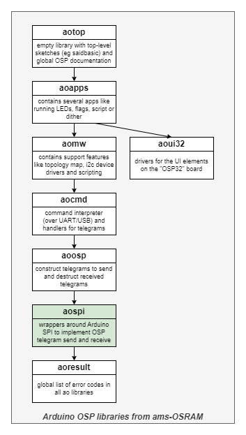

It implements the _communication layer_ between the MCU and OSP nodes;
it allows sending and receiving telegrams (actually, raw byte arrays) using 
the SPI blocks of the MCU.

Another library - _aoosp_ - implements how the telegrams byte arrays are formatted: 
the encoding of the arguments into bytes, the preamble, payload size indicator,
CRC, what response telegrams comes with which command telegram. It builds on top of _aospi_.


## System overview

The _aospi_ library is written for the OSP32 board in the SAID evaluation kit.
The diagram below gives an abstract overview of the OSP32 board and how
to connect demo boards. Demo boards are strips of OSP nodes, at the moment of
writing this document two types of nodes exist: the AS1163 ("SAID") and the 
OSIRE E3731i ("RGBi").

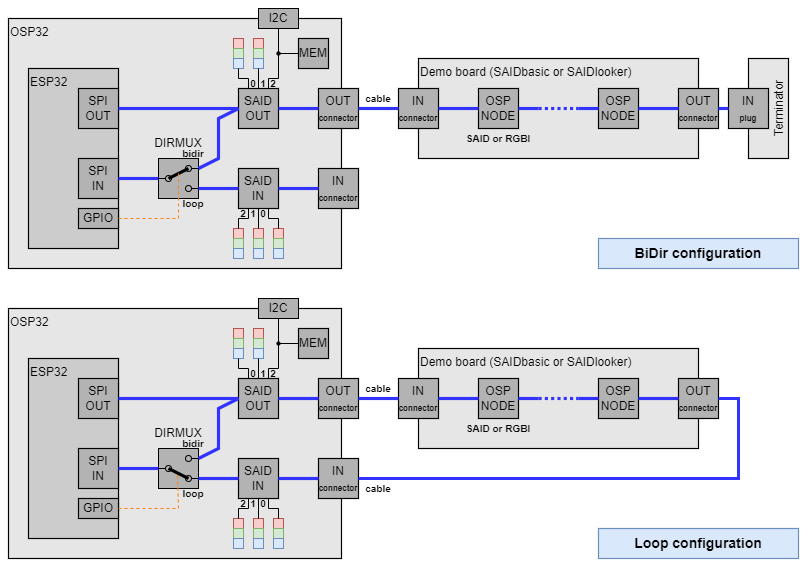

The OSP32 board contains an MCU: an ESP32 micro-controller. The MCU has two
SPI blocks, one for sending telegrams ("SPI OUT") and one for receiving telegrams
("SPI IN"). The SPI OUT is wired to an on-board OSP node ("SAID OUT"), which 
drives two RGB triplets and one I2C bus. The SAID OUT is wired to a connector
on the edge of the OSP32 board ("OUT").

The OUT connector is wired via zero or more demo boards to either a _terminator_
or, with a _cable_, back to a second connector on the edge of the OSP32 board 
("IN"). The IN connector wires to a second OSP node  ("SAID IN"), which
drives three RGB triplets.

When the terminator is present, the chain of OSP nodes is said to be in 
bidirectional mode ("BiDir"). In BiDir mode responses from OSP nodes are 
sent backwards over the chain, and thus appear on sio1 of SAID OUT. 
When the cable is present,  the chain of OSP nodes is said to be in loop-back 
mode ("Loop"). In Loop mode responses from OSP nodes are sent forwards 
over the chain, and thus appear on sio2 of SAID IN.

A switch known as "DIRMUX" either connects the sio1 of SAID OUT or 
the sio2 of SAID IN to the SPI receiver ("SPI IN"). 
The DIRMUX is controlled with a GPIO pin of the MCU.
There are two LEDs on the OSP32 board (labeled BIDIR and LOOP, not shown 
in the diagram) which indicate the state of the DIRMUX.

Note that SAID OUT (channel 2) is wired to an I2C bus (with an on-board I2C 
EEPROM memory). This allows testing the I2C capabilities of the SAID without 
the need to create additional hardware. Not shown in the diagram is that 
SAID IN also has a test feature: there is an option to connect channel 1/blue 
to the MCU and use that to issue a SYNC pulse. Finally note that the OSP32 
board has several test pins. This allows hooking up a logic analyzer, to trace 
telegrams.


## Examples

This library comes with the following examples.
You can find them in the Arduino IDE via 
File > Examples > OSP 2wireSPI aospi > ...

- **aospi_tx** ([source](examples/aospi_tx))  
  In this demo, a small set of telegrams has been hand-constructed.
  Those telegrams are passed directly to the SPI layer (_aospi_ lib).
  The demo uses a minimal amount of telegrams to switch on the LEDs 
  of the first SAID of the OSP32 board.

- **aospi_txrx** ([source](examples/aospi_txrx))  
  In this demo, a small set of telegrams has been hand-constructed.
  Those telegrams are passed directly to the SPI layer (_aospi_ lib).
  Some telegrams cause a response which is passed back from _aospi_,
  analyzed and printed.
  
  The demo can be run in BiDir or Loop mode.

- **aospi_time** ([source](examples/aospi_time))  
  This demo measures, in a BiDirectional chain, the round trip time for two 
  telegrams:  READSTAT (5 byte responses) and IDENTIFY (8 byte responses).
  Both telegrams are sent to each node in chain of length 5 (and then 10 
  times to allow some averaging).
  The measured times are compared with each other, to check two aspects.
  The first is the impact of addressing nodes further in the chain 
  (adding the fast forwarding time for each intermediate node).
  The second aspect is the impact of longer telegrams.


## API

The header [aospi.h](src/aospi.h) contains the API of this library.
The header contains little documentation; for that see the
[aospi.cpp](src/aospi.cpp) source file. 

Here is a quick overview:

- `aospi_tx(...)` sends a command telegram.

- `aospi_txrx(...)` sends a command telegram and receives the response.

- `aospi_dirmux_set_loop()` and `aospi_dirmux_set_bidir()` set the direction 
  mux to Loop respectively BiDir. One of these functions is typically 
  called once during OSP chain initialization time, but must be
  called before using `aospi_txrx()` (since that uses the direction mux).
  There are also observers of the current direction mux setting 
  (`aospi_dirmux_is_loop()` and `aospi_dirmux_is_bidir()`).

- For statistics, the library keeps track of the number of telegrams sent 
  (with `aospi_tx()` and `aospi_txrx()`) or received (with `aospi_txrx()`).
  These counters can be retrieved with `aospi_txcount_get()` respectively `aospi_rxcount_get()`.
  These counter can be reset to 0 with `aospi_txcount_reset()` and `aospi_rxcount_reset()`.

- For measurements, two functions are provided. The function `aospi_txrx_us()`
  returns the round trip time of the last `aospi_txrx()`. The function 
  `aospi_txrx_hops(...)` returns an estimate of the number of hops (telegram 
  forwards by intermediate nodes) that were needed by the last `aospi_txrx()`.
  
- To testing the (OSP32) PCB the following functions are provided. The first pair
  `aospi_outoena_set(...)`/`aospi_outoena_get()` allows testing the control line of 
  the output enable of the outgoing level shifter, the second pair 
  `aospi_inoena_set(...)`/`aospi_inoena_get()` allows testing the control line of 
  the output enable of the incoming level shifter. Do not use during regular
  operation.

- `aospi_init()` must be called before using any of the above functions.
  This configures all pins, interrupt routine, SPI master and SPI slave drivers
  and puts the mux to BiDir.

- The macro `AOSPI_TELE_MAXSIZE` defines the maximum size of an OSP telegram.

- Finally, there is the macro `AOSPI_VERSION`, which identifies the version of the library.


## Board design

The _aospi_ library assumes presence of certain peripherals and connections.
 
- An ESP32S3 is connected to two SAIDs.

- Level shifters with output enable separate the SAIDs from the ESP.

- A mux is implemented to select between the BiDir or Loop mode
 (by enabling the associated level shifter).

- Several pull-up and pull-down resistors configure default line levels.

At the moment, the **OSP32** board implements all these assumptions.


### High level schematic diagram

The following diagram sketches the assumed connections.


### Explanation of the schematic

The communication between the ESP and OSP chain involves several lines.

There are three lines (top part of drawing) for mastering command telegrams: 
clock (SCLK), data (MOSI), and enable (OENA).
The SCLK and MOSI are the output lines of the SPI master in the ESP.
The OENA is a GPIO of the ESP, which enables the output of the level shifter
when telegrams are being send over SCLK/MOSI.

> Sending command telegrams (TX) uses the so-called _OUT_ pipe (perspective of the ESP).

There are in total seven lines (bottom part of drawing) for receiving response telegrams: 
clock (SCLK), data (MOSI), enable (ONEA);
and also one to tap clock interrupts (CINT).
Furthermore the SPI slave needs a select line (SSEL), 
and since the OSP node doesn't have that, the ESP generates it (MSEL).
Finally, there is a GPIO line (DIRL) that controls the BiDir or Loop mode -
it controls whether the IN.BIDIR or the IN.LOOP level shifter has its
output enabled (towards the ESP). This implements a direction mux.

> Receiving response telegrams (RX) uses the so-called _IN_ pipe (perspective of the ESP).


### Issues

Some issues controlling OSP nodes deserve above normal attention. 
They are discussed in various sections of this document.

- RESET issue
- missing SSEL issue
- dual master issue
- different modes issue
- fixed clock issue
- mux issue


### Level shifter for sending

On the OSP32 board there is a level shifter between the MCU and the first 
SAID, dedicated to sending. This level shifter has several roles.

- As the name indicates, it shifts the 
  3V3 SPI lines of the MCU to the 
  5V SION and SIOP lines of the first OSP node.
  
- The level shifter, has an output disable on the OSP side.
  The MCU sets the output always to tri-state (not connected) except while
  sending a telegram. This is important, because in BiDir mode, the first 
  OSP node can also master a response telegram. If this happens at the same 
  moment the MCU is mastering a command telegram, then two masters would drive
  the lines, giving the possibility of a shortcut. This is referred to as the
  _dual master issue_.
  
- The output disable also solves the _RESET issue_.
  When the MCU sends a RESET telegram to the first node, the node will also 
  reset its comms mode (MCU, EOL, LVDS, CAN). To select which of the four
  modes to use the node will look at the SIO line levels and these should 
  indicate MCU (high for SIO.P and low SIO.N). 
  
  If not, the OSP node will select another comms mode (e.g. LVDS) and from 
  that moment it is no longer possible to send telegrams from the MCU to 
  the OSP node. It is effectively locked, until a power cycle.
  
  The MCU must ensure the correct N and P line levels after mastering 
  the RESET telegram (not the N and P levels that the SPI master happens
  to leave the SCLK and MOSI lines in). An easy way to do that is to 
  disconnect the SPI block from the node by using the output disable of 
  the level shifter.

The level shifter used on the OSP32 board is unidirectional, 
but that is not very relevant.

If the MCU has 5V SPI lines, a level shifter is not needed. However, the 
second (dual masters) and third bullet (_RESET issue_) still need to be 
covered. Both could be covered with a buffer. Another option is to 
reconfigure the MCU pins after an SPI transaction, switching them to 
tri-state.


### Two level shifters for receiving

On the OSP32 board there are _two_ level shifters between the MCU and the 
OSP chain dedicated for reception: one for the first node (in case of BiDir 
setup) and one for the last node (in case of Loop setup). 
Like the "send level shifter", these two level shifter have several roles.

- As the name indicates, they shift the 5V SION and SIOP lines of the first 
  or last OSP node to the 3V3 SPI lines of the MCU.

- The level shifters have an output disable on the MCU side.
  Their outputs are wired together, but the _selector_ block only enables 
  one of them at a time solving the _mux issue_. The three together 
  implement an input mux under control of the MCU. It selects between 
  BiDir responses (from the first OSP node) or Loop responses (from the last 
  OSP node).
  
  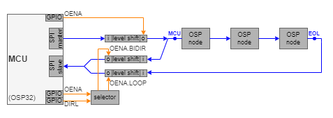

- The MCU sets the outputs always to tri-state (output disable) except while
  receiving a telegram. This helps, in BiDir mode, to not receive the command 
  telegram which is send. 

- The level shifters are unidirectional. This solves the _RESET issue_ 
  (see above) for reception side.

  **Warning:** some (bidirectional) level shifters have pull-ups on both 
  sides. If such a shifter were used on the reception side, the _RESET issue_ 
  pops up here as well: when the last node receives a RESET, it would see 
  both SIO lines towards the MCU being pulled up, making the node reconfigure 
  that SIO port to CAN instead of EOL.

- On the OSP32 board, the _selector_ block is implemented with a quad NOR.
  It ensures that at no time both level shifters have their output enabled.

Real-life applications (as opposed to the evaluation kit the OSP32 is) 
typically chose either BiDir or Loop but not both. As a result, the 
_selector_ and one level shifter can be removed.

On top of that, if the MCU has 5V SPI lines, the (last) level shifter is also 
not needed. However, the _RESET issue_ must be solved (but probably having 
the MOSI and SCLK line as inputs is sufficient).


### No level shifters - 5V MCU

When the MCU is 5V, there is no reason to have level shifters.
However, the RESET issue and  dual master issue still need to be solved.
This could be solved by replacing the OUT level shifter by an external buffer 
with tri-state output. If that one is controlled via the OENA line, there is 
no need to change the library. The IN (either from BiDir or Loop) is 5V 
_input_ so no need for a buffer. 

If the IN also needs the MUX (support for both BiDir and Loop), the two 
IN level shifters could be replaced by two external buffers with tri-state 
output (or some other switch). Again, if they are controlled via the 
OENA.BIDIR and OENA.LOOP lines, there is no need to change the library.

It is even possible, if the MCU supports those capabilities, to absorb the 
tri-stating in the MCU, by configuring the OUT pads as tri-state instead of 
setting OUT OENA low. This would require a change in the library.

Also the MUX could be implemented by an MCU if it has an internal pin MUX. 
Also this would require a change in the software, re-configuring pins when 
the current firmware changes DIRL.

The diagram below shows the various connection possibilities, upper left 
(green) the OSP32 board.


The left-most column assumes a 3V3 MCU, and thus uses level shifters.
The three architectures in this column are supported by the aospi lib.

The center column assume a 5V MCU, so no level shifters are needed.
However due to the RESET issue and dual master issue, a buffer with tri-state 
is needed. For BiDir and Loop only rows, no mux is needed, so the IN buffers 
can be avoided in the lower two rows. The three architectures in the center 
column are supported by the aospi lib.

The right-most column assumes a 5V MCU, so no level shifters are needed.
This column assumes an MCU that can dynamically re-configure its (OUT) pads 
to tri-state, and can dynamically re-route (IN) pads to internal peripherals 
(thus implementing a pin MUX). The ESP32S3 on the OSP32 board has these 
features (but it is 3V3). The three architectures in the right-most column 
require changes to the aospi lib: replacing control of the output enable 
lines (red) or BiDir/Loop select line (blue) with pad-configuration or 
pad-reroute instructions specific for that MCU.

The two options in the lower right (green) would be typical production board 
implementations (no extraneous components, like on the evaluation board)


## Module architecture

ESP32S3 integrates 4 SPI peripherals. 
SPI0 and SPI1 are used internally to access the ESP's attached flash memory.
This library uses SPI2/HSPI for mastering and SPI3/FSPI for slaving.

The SPI _master_ driver comes with the ESP tool chain. The SPI _slave_ driver 
comes from [Hideaki Tai](https://github.com/hideakitai/ESP32SPISlave).
The _aospi_ library comes with a [copy](src/slave) of ESP32SPISlave included, 
to ensure there are no versioning issues. The imported library is actually 
a single h-file (with code).


The `aospi.cpp` wraps the master and slave driver, with code to handle the 
level shifters, selector, slave select, etc.


## Execution architecture

Sending command telegrams using 2-wire SPI is relatively straightforward
using the standard ESP SPI master driver.

Receiving response telegrams is harder, even with Hideaki Tai's driver.
This is mainly due to the stringent timing requirements.
Most tough scenario is getting a response from the first node in BiDir mode.
The ESP has 5us to switch from mastering to slaving.

This chapter explains the execution architecture in more detail.


### Sending command telegrams

- The MCU sends (command) telegrams to the first node of the OSP chain 
  (SAID OUT on OSP32 board). The MCU typically uses an SPI _master_ block 
  for that.
  
- The first node must always be configured in _MCU mode_ 
  (pull-up on SIO.P and pull-down on SIO.N).

- The communication between MCU and first node is either 
  _1-wire SPI_ or _2-wire SPI_.

  - 1-wire SPI only uses the P wire. The signal contains clock and data by 
    using so-called _Manchester_ encoding. This means that the MCU firmware 
    must "double" the telegram bits before it passes the telegram to the 
    SPI master block.
    
  - 2-wire SPI uses the P wire for data and the N wire for clock.
    This means that the MCU firmware can just pass the telegram to 
    the SPI master.
    
  - The selection between 1-wire SPI and 2-wire SPI is made by an OTP bit 
    in the SAID (bit 0D.3 `SPI_mode`).
    
  - The SAID AS1163 has this OTP bit, the OSIRE RGBi E3731i only supports 
    1-wire SPI.
  
  - **The _aospi_ library only supports 2-wire SPI**.


### Receiving response telegrams

- The OSP chain sends (response) telegrams back to the MCU.
  The MCU typically uses an SPI _slave_ block for that.
  
- A configuration choice has to be made: 
  either the first or the last node of the chain sends back the responses.
  
  - If the first node is chosen, this is known as bi-directional (_BiDir_) 
    communication.
  
    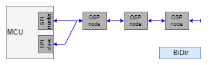
    
  - If the last node is chosen, this is known as uni-directional (_Loop_) 
    communication.
  
    
    
  - The OSP32 board and this library support both modes.
  
- In either case, the last node must be configured for _EOL mode_
  (pull-down on SIO.P and pull-up on SIO.N).
  
   - In Bidir, a _terminator_ (which has the two resistors) must be attached 
     to the last node. Secondly, the first node must be connected to the MCU 
     slave block.
  
   - In Loop, a _wire_ connects the last node to the MCU slave block 
     (SAID IN on OSP32 board) and it must be configured for _EOL mode_ 
     (pull-down on SIO.P and pull-up on SIO.N).
  
- On the OSP32 board, the first node is connected to the SPI slave, and the
  last node is connected to the SPI slave, and a mux selects the active 
  connection.
  
  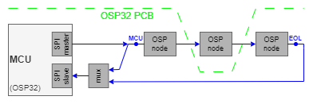


### Telegram timing

- Below diagram is the timing of one telegram to one node.
  The diagram focuses on the OSP node that receives the command,
  executes the command and (optionally) gives a response.

  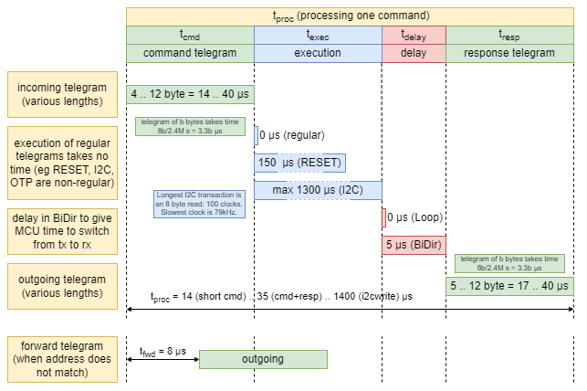

- The resulting system trip timing, not in one node but in a chain, is 
  depicted below. Here we also look at the nodes before and after the 
  executing node.

  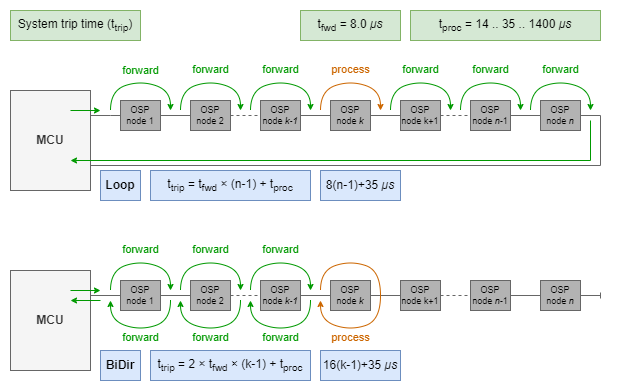
  
- We have temporarily modified `aospi.cpp` to pulse OENA to flag
  the moments the round trip timing measurements are made in the driver.
  
  This allows us to validate the theoretical timings with reality.
  There is a bit of time cause introduced by software, but the match
  is quite accurate, see below trace.
  
  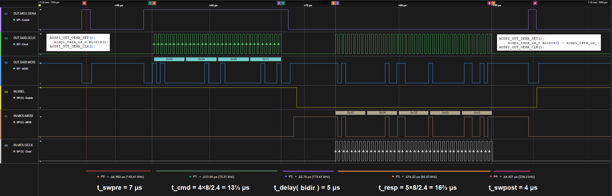


## Implementation notes

- The _aospi_ library is hardwired to use specific pins of the ESP32S3.
  The library could be used with other pins of the ESP32S3, and maybe even 
  with other ESP32xx MCUs. In this case the macros that identify pins 
  (like `#define AOSPI_OUT_SCLK  4`) have to be changed. See 
  [aospi.cpp](src/aospi.cpp) for those macros, and refer to the high level 
  schematic diagram.

- To send a command telegram (`aospi_tx()`), the SPI master driver on the 
  ESP is used. It follows the Arduino documentation.
  
  ```C++
  spi.beginTransaction(...);
    digitalWrite(SSEL, ACTIVE);
    spi.transferBytes( txbuf, rxbuf, size );
    digitalWrite(SSEL, INACTIVE); 
  spi.endTransaction();
  ```
  
  The _aospi_ implementation (`aospi_tx()`), replaces the SSEL with OENA to 
  enable the output of the level shifter. 
  This is relevant for the _RESET issue_ and the _dual master issue_ (see above).

  One timing requirement that is not free in OSP is on SCLK (in plain SPI, 
  the master can vary the clock as long as it is not too fast).
  The clock must be 2.4MHz and no delays are allowed e.g. between bytes 
  (_fixed clock issue_). The reason is that OSP has no SSEL, 
  so a dead time of about two clocks signals end-of-frame.
  
  Another timing requirement is on RESET. 
  All commands execute faster than they can be forwarded, so multiple 
  writes cause no problems (ignoring writes that trigger a response).
  There are a couple of exceptions to this rule; one is the RESET command.
  A node forwards the RESET to its successor (in the usual fast way of 7 us),
  but then RESETs itself. This takes 150us, and during that time no
  telegrams should be send to that node.
  
- The SPI slave driver from Hideaki Tai has a non-trivial API 
  especially for the most flexible use "Non-blocking multiple transactions".
  The SPI slave drivers maintains a queue of transactions (byte buffers).
  It is only possible to receive SPI messages when the queue is non-empty.
  This is known as "transactions are in flight". 
  When an SPI message comes in, the driver takes a transaction (buffer) 
  from the queue, and uses that to store the incoming bytes. Then, 
  "the transaction is completed". See 
  [driver documentation](https://github.com/hideakitai/ESP32SPISlave?tab=readme-ov-file#non-blocking-multiple-transactions).

- The SPI slave sees response telegrams either from the first node
  (when using BiDir direction), or from the last node (Loop direction).
  Recall that the first node has its SIO configured in MCU mode, with P
  pulled up, and N pulled down. The last node has its SIO configured as
  EOL, with P pulled down, and N pulled up.
  
  This is relevant, because when an OSP node acts a master (for a response), 
  its default clock line (N pad) follows this convention. In other words, 
  when an OSP node masters in MCU configuration (BiDir), it uses _SPI mode 0_: 
  clock (N pad) default **low**. When an OSP node masters in EOL configuration 
  (Loop), it uses _SPI mode 3_: clock (N pad) default **high**. This is known 
  as the _different modes issue_. In both cases data is captured by the SPI 
  slave in the MCU on the rising clock. The MOSI line (P pad) does not have 
  defaults in the SPI protocol.
  
  In OSP context, the SPI block is only receiving data (MOSI) it is
  not sending data (MISO) back to the master (OSP node). Sending would
  happen on the opposite clock edge (falling clock).
  
  Since the slave only needs to receive, it is only triggered by the
  rising edges of the clock. As a result, the _ESP SPI slave driver can
  receive both BiDir and Loop telegrams using both MODE0 or MODE3_.
  
  This is expected to hold for other MCUs as well but has not been checked.

- To receive a response telegram, first a command telegram has to be send 
  (`aospi_txrx()`). This function is time critical. It consists of the 
  following steps.
  
  ```
  queue a transaction in the underlying SPI slave driver
  transmit the command telegram (OUT OENA hi, transfer bytes, OUT OENA lo)
  connect ESP to OSP chain (IN OENA hi), enable reception (assert IN SSEL via MSEL)
    wait for response (see below)
  disable reception (deassert IN SSEL) and disconnect ESP (IN OENA lo)
  pick up received bytes from SPI slave driver
  ```  

- Note that a couple of actions need to be taken after sending and before 
  receiving. Among that are three GPIO writes (OUT OENA, IN OENA, MSEL).
  In order not to lose time (OSP gives 5 us for the switch over), 
  Arduino's `digitalWrite()` has been replaced with direct SFR (special 
  function register) access (eg `AOSPI_IN_OENA_SET()`).

- Next to the short handover time, there is another issue: the 
  _missing SSEL issue_. OSP nodes do not have an outgoing SSEL line, and ESPs 
  cannot work without them (they need them to frame a message to know which 
  byte is the last). The OSP32 board has a loop back wire (from MSEL to SSEL).
  Since a response comes as an answer to a command, there is a known moment 
  to assert MSEL.

  However, the SPI slave driver does not have a call-back when it receives 
  bytes. If MSEL would de-assert early, the SPI driver would return a 
  transaction (byte buffer) of length 0.
  
  To solve this there is another line, a tap on SCLK to GPIO pin CINT.
  An interrupt service routine attached to that counts clock ticks.
  Since response telegram length is given (max 12 bytes or 96 clock ticks) 
  this tells when to de-assert MSEL once an interrupt for a clock tick has 
  occurred.
  
  The `wait for response` (above) is implemented as follows.
  
  ```
    reset counter that counts clock tick (in ISR)
    wait while counter stays zero but no longer than 17.4ms (timeout)
    wait (response length - counter)/2.4MHz
  ```
  
- The time out of 17.4 ms used in the code is based on the worst-case chain 
  (longest OSP chain in BiDir) and the worst-case command (I2C read of 
  8 bytes with slowest clock).


## Traces

Two traces from a [logic analyzer](https://www.saleae.com/pages/downloads) 
are available with this documentation.
The high level schematic diagram indicates where the probes of the 
logic analyzer are placed (colored circles).

### BiDir mode

A trace is made, while running `aospi_txrx` in BiDir mode.
The trace is also part of the documentation: [aospi-txrx.bidir.sal](extras/aospi-txrx.bidir.sal).


- The purple pulses (D7, OUT.MCU.OENA) indicates when the OUTlevel shifter is enabled, 
  i.e. when a command telegram is send. The above screenshot shows four: RESET, INITBIDIR, CLRERROR, and GOACTIVE.
- The blue and green lines show data (D5 OUT.SAID.MOSI) and clock (D5 OUT.SAID.SCLK) of the first node.
  See below for a zoom in.
- The orange and red lines show data (D3 IN.SAID.MOSI) and clock (D2 IN.SAID.SCLK) of the last node.
- Observe that after the RESET telegram both the clock of the first and the data of the last node show a pulse.
  This is part of the reset cycle of those nodes, establishing their new comms mode.
- Observer that after the second pulse (INITBIDIR), the first node starts mastering the response.
- The brown and white lines show data (D1 IN.MCU.MOSI) and clock (D0 IN.MCU.SCLK) of the slave block.
- Observe that the slave sees the response.

The figure below shows details of the INITBIDIR command ans response. 


- The BIDIR command telegram being send is sliced by the logic analyzer as A0 04 02 A9; 
  this matches the source code.
- The response telegram is sliced as A0 09 02 00 50 6D, 
  which shows that the last node has address 2 in response to a INITBIDIR.
  

The figure below shows details of the INITBIDIR command ans response. 

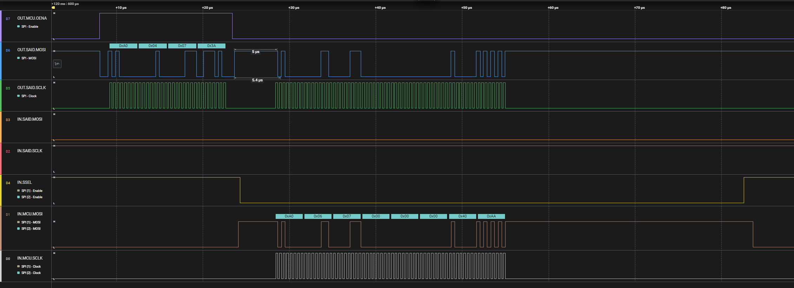

- Observe the tight timing (5 us) between command and response.
- The response telegram is sliced as A0 06 07 00 00 00 40 AA, the 00000040 is the type for SAID.
- Observer that the default clock line of the response is **low**.


### Loop mode

A trace is made, while running `aospi_txrx` in Loop mode.
The trace is also part of the documentation: [aospi-txrx.loop.sal](extras/aospi-txrx.loop.sal).

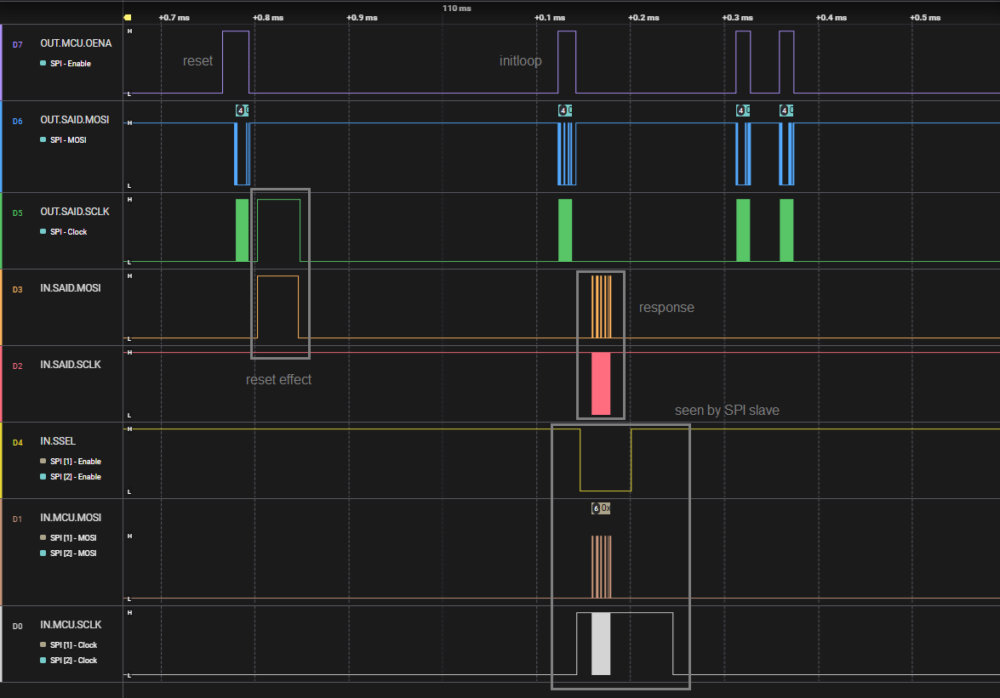

- We see the same pulses after the RESET telegram.
- Observer that after the second pulse (INITLOOP), the last node starts mastering the response.
  We see that on the orange and red lines (D3 IN.SAID.MOSI and D2 IN.SAID.SCLK).
- The brown and white lines show what the SPI slave sees.

The figure below shows details of the INITLOOP command and response. 


- The LOOP command telegram being send is sliced by the logic analyzer as A0 04 03 86; 
  this matches the source code.
- The response telegram is sliced as A0 09 03 00 50 63, 
  which shows that the last node has address 2 in response to a INITBIDIR.

  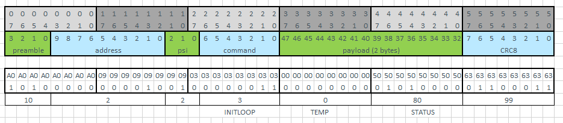

- Observer that the default clock line of the response is **high**.


## Version history _aospi_

- **2024 October 8, 0.5.4**
  - `src/slave/*` line endings changed from LF to CR+LF.

- **2024 October 7, 0.5.3**
  - Prefixed `modules.drawio.png` with library short name.
  - Moved domain from `github.com/ams-OSRAM-Group` to `github.com/ams-OSRAM`.

- **2024 September 10, 0.5.2**
  - Changes in `readme.md`.
  - Fixed Bug in `aospi_txrx`; function `aospi_dirmux_set_loop()` no longer needs parameter.
  - Added BEHAVIOR section to explanation in examples.
  
- **2024 September 5, 0.5.1**
  - API section in readme now shows parameter names.
  - Text updates in `readme.md`.
  - Text update in documentation of `aospi_txrx_hops()`.

- **2024 August 28, 0.5.0**
  - Added new api functions `aospi_txrx_us()` and `aospi_txrx_hops()`.
  - Added example `aospi_time.ino`, using the new api functions.
  - Added round trip timing trace picture.
  - Added links in `readme.md` for all example sketches.
  - Extended "System overview" (and detailed the image).
  - Fixed warning on `printf` format specifier in `aospi_txrx.ino`.

- **2024 August 9, 0.4.2**
  - Added "System overview" to `readme.md`.
  - Small update to `dirosp32.drawio.png`.

- **2024 August 5, 0.4.1**
  - Corrected landing page link in readme.md from aotop to OSP_aotop.
  - Updated the two timing diagrams (telegram and chain).
  - Remove "oalib" from `sentence=` in `library.properties`.
  - Check with `AORESULT_ASSERT(aospi_inited)` in `aospi.cpp` test getters & setters.
  - Tab2spaces in `aospi.cpp`.
  - Text updates in `readme.md`.
  - Fixed typos `@parm` to `@param`

- **2024 July 7, 0.4.0**  
  - Arduino name changed from `OSP 2-wire SPI - aospi` to `OSP 2wireSPI aospi`.
  - Added link for traces.
  - Added blue slave line in BiDir diagram (`dirbidir.drawio.png`) and green dashed OSP32 border line in OPS32 diagram (`dirosp32.drawio.png`).
  - Renamed dir `extra` to `extras`.
  - Small corrections in readme.md.
  - Added (for board testing) `aospi_outoena_set()`/`aospi_outoena_get()` and `aospi_inoena_set()`/`aospi_inoena_get()`.

- **2024 July 3, 0.3.1**  
  - `license.txt`, `aospi_tx.ino`, `aospi_txrx.ino` line endings changed from LF to CR+LF.

- **2024 July 2, 0.3.0**  
  - Initial release candidate.


(end)
